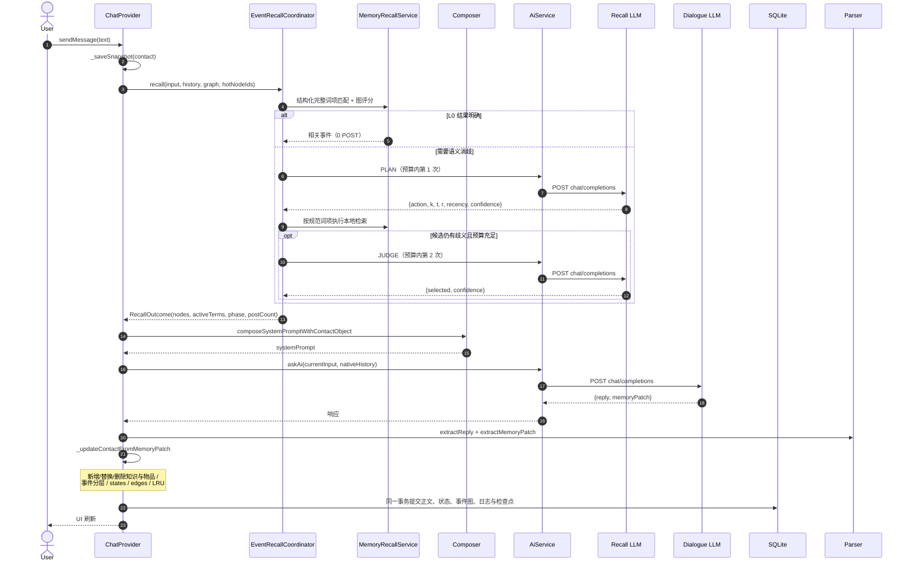
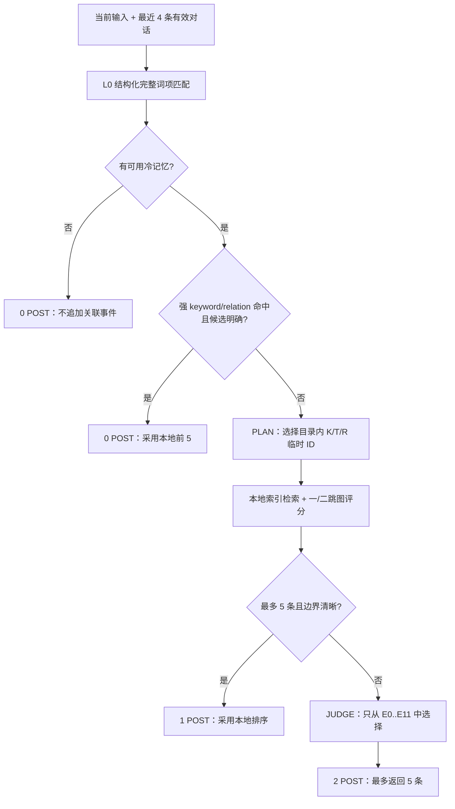
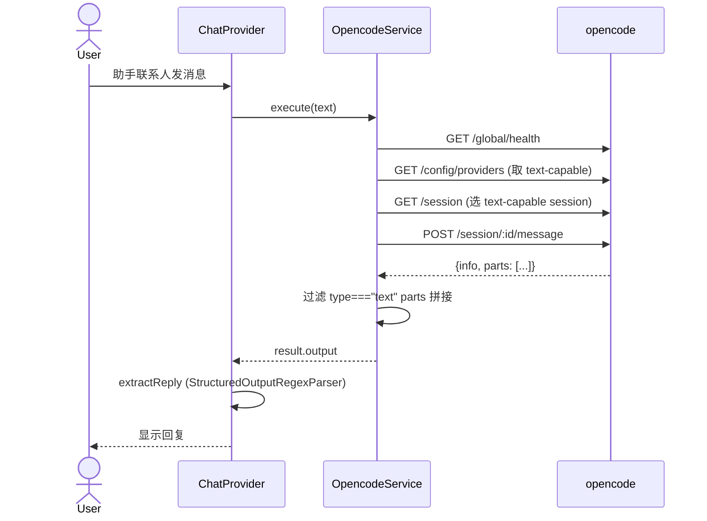

# AI 角色扮演对话应用

> 基于 Flutter 的本地 AI 角色/故事对话应用：手动故事状态、持久化剧情回滚、稳定提示词前缀与低成本事件召回。

当前工作区的连续性与成本重构说明见 [CONTINUITY_REFACTOR.md](docs/CONTINUITY_REFACTOR.md)，Agent 式提示词组织说明见 [AGENT_PROMPT_REFACTOR.md](docs/AGENT_PROMPT_REFACTOR.md)。

[](.) [](.) [](.)

---

## 项目定位

单设备、本地存储优先的 AI 角色扮演 App。长期记忆不会由项目自建云端保存；生成时只把本轮所需的角色上下文发送到用户自行配置的 LLM HTTP 服务（base URL + API Key）。

> 新版状态与事务行为以 [连续性重构说明](docs/CONTINUITY_REFACTOR.md) 为准。想看此前的完整架构与数据流图：见 [docs/architecture.html](docs/architecture.html)（含 mermaid 流程图、状态机、数据存储布局、参数对照表）。

## 三种联系人

| 类型 | category | 引擎 | 走哪条路径 |
|---|---|---|---|
| **角色** | `ContactCategory.contact` | LLM + 结构化记忆 | `sendMessage` → `AiService` → 事件图 |
| **故事** | `ContactCategory.story` | LLM + 结构化记忆（叙事规则不同） | 同上，`_buildJsonFormat(isStory: true)` |
| **助手** | `ContactCategory.assistant` | opencode 桥接 | `_sendAssistantMessage` → `OpencodeService` |

## 核心能力

- **统一手机视觉与资料编辑**：浅色/深色系统主题、圆角分组、消息与导航动效；点击顶部信息栏、聊天头像或侧栏头像编辑名字、角色设定、状态和知识。头像支持 JPG/JPEG、PNG、WebP，照片压缩后随本地备份保存，详见 [UI 与资料编辑说明](docs/UI_PROFILE_v2.5.0.md)。

- **按故事配置状态**：手动定义名称、记录说明、初值与更新规则；定义和当前值分开保存，可改名、排序、删除和清空。状态增量校验 ID、版本、旧值和文本格式，完整值不被摘要裁剪
- **Agent 式提示词分层**：system 依次放置不可覆盖的运行契约、用户行为指令、完整角色配置、世界书和状态定义；权威状态与召回记忆作为本轮上下文，最近对话使用原生 `user/assistant` 消息发送
- **流式友好的 v5 协议**：JSON 固定按 `protocolVersion → reply → memoryPatch` 序列化，使正文可先显示；记忆支持 `add / replace / remove`，旧事实失效或物品丢失时不会只增不减
- **三级记忆级联**：短期 → 长期 → 超长期，阈值触发 + LLM 压缩；对话 Prompt 默认保留短期 10、长期 1、超长期 2 条热记忆，详见 [架构图](docs/architecture.html#memory-tiers)
- **低成本 Agent 式事件召回**：固定执行 `L0 → PLAN → JUDGE` 状态机。L0 只匹配模型已写入的完整关键词、主题和关系键，不分词、不做模糊字符匹配；结果明确时 0 次额外调用，只有歧义时才自适应使用 1–2 次小模型调用
- **严格请求预算**：单轮事件召回最多 2 个实际 HTTP POST；超时、网络失败和 404/405 兼容端点探测同样扣减预算，已验证端点会缓存。召回失败只退化为本地结果，不阻断正文模型
- **事件间边关系**：LLM 通过 `relatedEventIds` 声明强关联，**硬上限 2 个**；LRU 排序按关键词 + 邻居 + 物品/设定 关联权重综合打分
- **三种创建方式**：表单 / JSON 导入 / 自然语言描述（LLM 转 JSON）
- **持久化撤回**：重启后仍能连续撤回，恢复消息、配置、状态和完整记忆
- **流式输出与停止**：OpenAI 兼容 SSE 流式回复逐块显示；流式/非流式请求均可立即停止并保留明确状态
- **一致的消息修改**：重发、修改后重发、删除均先撤销目标轮及后续剧情，正文和记忆同步回滚；旧历史缺少可靠检查点时拒绝部分删除
- **停止与安全重生成**：可修改上一轮输入，在完整撤回旧回复和旧记忆后重新生成
- **会话搜索与用量估算**：搜索完整会话历史、预览上下文，并估算当前窗口 Token 与费用
- **多 LLM Profile**：可保存多个正文 Profile、快速切换、批量健康检查，并为每个 Profile 独立设置输出上限和兼容的 JSON 响应模式；PLAN/JUDGE 可单独配置廉价事件召回模型
- **可视化记忆档案**：三标签页（列表/时间线/召回调试），按层级和状态筛选，关键词搜索，来源对话追踪，每条记忆的事件关系边和邻居节点可视化，完整召回调试信息展示
- **世界书系统**：地点、组织、规则、时间线事件的独立管理，四标签页 UI，自动注入 LLM Prompt 作为角色行为参考
- **图片画廊与缓存**：生图自动缓存到本地文件系统，LRU 淘汰；网格画廊支持角色筛选、全屏预览；角色外观一致性算法（特征签名 + 种子锁定 + 参考图）确保同一角色图片风格一致
- **TTS 音色与播放**：联系人编辑页可试听音色，聊天消息可拉取真实音频并通过系统媒体播放器播放/停止
- **SQLite 本地数据库**：正文、状态、知识、事件图、轮次日志和自动检查点在同一事务提交；检查点用位置与版本保存，避免逐轮复制完整正文
- **万级消息分页**：启动只载入当前会话最近 100 条，可向前加载；完整备份仍包含全部历史
- **剧情检查点与分支**：成功轮次自动建立可逆检查点，可从历史回复创建、切换、重命名和备份剧情分支
- **完整本地备份**：版本化 JSON 保存角色、消息、事件图、分支和可逆日志，单个事务恢复；不覆盖 API、模型和应用设置
- **调试模式**：显示完整 prompt + 召回阶段、实际 POST 数、激活词项与选中事件
- **应用设置**：20 项可调（详见 [应用设置](#应用设置)）

## 项目结构

```
lib/
├── main.dart, app.dart              # 入口
├── features/
│   ├── chat/
│   │   ├── domain/
│   │   │   ├── providers/chat_provider.dart     # 页面状态与用例编排
│   │   │   ├── repositories/chat_persistence.dart
│   │   │   └── services/                        # 记忆、Agent 召回、修订、角色/故事策略
│   │   ├── data/
│   │   │   ├── models/{contact,message}.dart    # 联系人（含 eventGraph、worldBook）、消息
│   │   │   ├── repositories/chat_repository.dart
│   │   │   └── datasources/                     # SQLite 主存储 + 旧数据只读迁移源
│   │   └── presentation/
│   │       ├── pages/chat_page.dart              # 主聊天界面
│   │       └── widgets/{contact_sidebar,contact_editor_dialog}.dart
│   └── worldbook/
│       ├── domain/entities/                      # WorldLocation, WorldOrganization, WorldRule, WorldTimelineEvent
│       ├── domain/services/                      # WorldBookService（CRUD + 搜索）
│       └── presentation/pages/                   # 世界书四标签页 UI
│   └── media/
│       ├── domain/services/                      # ImageCacheService（本地缓存 + LRU 淘汰）
│       └── presentation/pages/                   # 图片画廊（网格 + 全屏预览）
├── core/
│   ├── constants/{api_constants,app_strings}.dart
│   ├── data/models/app_settings.dart
│   ├── presentation/pages/{app_settings,assistant_config}_page.dart
│   └── utils/
│       ├── structured_input_prompt_composer.dart  # prompt 拼接
│       └── structured_output_regex_parser.dart    # JSON 解析
└── infrastructure/services/
    ├── ai_service.dart        # LLM HTTP 客户端
    └── opencode_service.dart  # opencode REST 客户端
```

## 数据流（角色对话，单轮）



## 低成本事件召回状态机

事件召回不是一个可以自行循环的开放式 Agent，而是边界固定、可验证的两阶段状态机：



- **热记忆**是已经进入正文 Prompt 的短期/长期/超长期固定窗口；额外召回只从其余冷记忆中选择，避免重复占用上下文。
- **L0 不生成查询词**：只做 trim、ASCII 小写、全角转半角以及空白/常见标点归一，再检查完整已存词项。CJK 单字仅在整段输入等于该词时命中，拉丁词要求字母数字边界。
- **结构化证据优先**：keyword、belonging/setting relation、theme 按固定权重评分，再以一跳和二跳关系补充候选；直接命中始终排在纯图扩展之前，`invalidated` 永不返回，`needsReview` 不会自动确认。
- **模型只能选择，不能改写记忆**：PLAN 只能返回本轮目录里的临时 K/T/R ID；JUDGE 只能返回冻结候选里的 E ID。未知 ID、超限数组和无效 JSON 会被丢弃并退化到本地排序。
- **成本上限按实际 POST 计算**：每轮独占 `RecallRequestBudget(maxPosts: 2)`。兼容端点探测若消耗两次请求，本轮就不会再进入 JUDGE。

## 三级记忆（1→2 与 2→3 级联）

- **1→2** 触发：短期 un-summarized ≥ `summaryThreshold`（默认 10）
  - LLM 强制输出 `summary`，进入长期 un-summarized
  - 旧 brief 留在短期原位并标记 summarized，不批量复制到长期
- **2→3** 触发：长期 un-summarized ≥ `ultraSummaryThreshold`（默认 5），**仅在 1→2 未触发时**
  - 同样 LLM 输出 `summary`，进入超长期 un-summarized
  - 旧长期 entry 留在长期原位并标记 summarized，不批量复制到超长期
- summary 仅按阈值请求；只标记实际发送给模型的源节点，自主输出的摘要不应用
- 调 `ultraSummaryThreshold = 999` 即禁用 2→3

> 总结要求放在动态上下文中，不改变固定 system；总结失败保留原事件。

## 边关系

LLM 在 `memoryPatch.relatedEventIds` 里声明与本次事件强相关的往期事件编号：

- **硬上限 2 个**，重复边去重
- 提示词里强调：宁缺毋滥，不要连环关联
- 用于建立事件间边图，LRU 评分时会按 `lruEventEventWeight`（默认 50）给邻居事件加成

## 助手（opencode）

不走 LLM，直接 HTTP 调 PC 上跑的 `opencode serve`（默认 :4096）：



**关键点**：
- 选模型/session 时**过滤 TTS / 纯 audio 模型**（`capabilities.output.text !== false` 且 id/name 不含 `tts`）
- LLM 响应结构和角色相同（`{reply, memoryPatch}`），按 `extractReply` 取 `reply` 字段
- 缓存 `sessionId` 持久化，复用同一会话
- Android 9+ 走明文 HTTP 需 `network_security_config.xml`（已配）

### opencode 声明与致谢

本项目的助手桥接、远程执行与会话复用等部分功能基于 opencode 的服务接口与开发体验进行适配和开发。感谢 opencode 项目及其社区提供的开放工具与启发。

本项目是独立开发的 AI 角色/故事对话应用，与 opencode 项目及其维护者不存在从属、隶属、官方合作或背书关系；项目中的 opencode 相关能力仅作为可选桥接功能使用。

## 远程连接 PC 上的 opencode

| 方式 | PC 端 | 安卓端配置 | 优缺点 |
|---|---|---|---|
| **Tailscale** | 装 Tailscale，登录同账号 | host=100.x.x.x, port=4096, http | 一次配好长期稳定，4G/5G/Wi-Fi 都通 |
| **Cloudflare Tunnel** | `cloudflared tunnel --url http://localhost:4096` | host=trycloudflare.com, port=443, https ✓ | 零配置，URL 每次启动会变 |
| **VPS SSH 反代** | `ssh -R 14096:127.0.0.1:4096 user@vps` | host=VPS 公网 IP, port=14096, http | 灵活但 VPS 自身是攻击面 |

> PC 启动：`opencode serve --hostname 0.0.0.0 --port 4096`（建议 `export OPENCODE_SERVER_PASSWORD=xxx`）

## 应用设置

应用设置页（右上角齿轮）共 20 项，分 6 组：

| 分组 | 设置 | 默认 | 范围 |
|---|---|---|---|
| **LLM 输入限制** | maxShortTermEvents | 10 | 1-50 |
| | maxLongTermEvents | 1 | 1-30（默认只取最新 summary；老 summary 走 2→3 进超长期） |
| | maxUltraTermEvents | 2 | 1-20 |
| | maxRelatedEvents | 5 | 1-20 |
| **本地存储限制** | maxShortQueue | 2000 | 100-10000 |
| | maxLongQueue | 500 | 50-5000 |
| | maxUltraQueue | 200 | 20-2000 |
| **Prompt 限制** | maxPromptListItems | 5 | 1-20 |
| | maxPromptLineLength | 200 | 50-1000 |
| **事件处理** | summaryThreshold | 10 | 2-50 |
| | ultraSummaryThreshold | 5 | 2-100（设 999 禁用 2→3） |
| **关联检索** | searchDepth | 2 | 本地图评分的关系扩展深度；Agent 召回只定义一跳和二跳贡献 |
| | vectorSimilarityWeight | 80 | 0-100（已废弃，向量记忆未启用） |
| **LRU 权重** | lruKeywordMatchWeight | 100 | 1-500 |
| | lruEventEventWeight | 50 | 1-300 |
| | lruEventBelongingKeywordWeight | 30 | 1-200 |
| | lruEventBelongingNormalWeight | 10 | 1-100 |
| | lruEventSettingKeywordWeight | 30 | 1-200 |
| | lruEventSettingNormalWeight | 10 | 1-100 |
| **关键词库** | keywordLibrarySize | 200 | 50-1000 |

API 提供商页另有“召回”标签：关闭独立配置时，额外召回请求复用主 LLM；开启后使用单独的 `memoryRecallLlm`。PLAN/JUDGE 会强制采用非流式、低温度、小输出上限和 12 秒超时，不受该 Profile 中生成参数的高成本配置影响。

## 数据存储

| 数据 | 存储 | Key |
|---|---|---|
| 联系人 | SQLite | `contacts` |
| 消息历史 | SQLite | `messages` |
| 三级事件 | SQLite | `event_nodes` |
| 事件边和物品/设定关系 | SQLite | `event_edges` / `event_relations` |
| 记忆图元数据 | SQLite | `memory_meta` |
| Agent 设置（API Key、系统提示词） | SharedPreferences | `chat_settings_v1` |
| App 设置（20 项参数） | SharedPreferences | `app_settings_v1` |
| Provider 设置（正文、备用、召回、生图、TTS） | SharedPreferences | `provider_settings_v1` |
| opencode 连接配置 | SharedPreferences | `opencode_connection_v1` |

旧版 SharedPreferences 联系人和消息会在首次启动时校验并迁移到 SQLite；迁移成功后旧数据不会被主动删除，可作为回退副本。

## 已知限制

- **结构化词项质量决定召回上限**：V1 依赖正文模型写入的 `keywords/theme` 与物品/设定关系键；别名未统一或事件漏标时不会用分词、n-gram、编辑距离、拼音、Embedding 或向量检索猜测
- **无结构化连续性时不会额外调用**：当前输入未命中，且最近 4 条有效对话也没有指向冷记忆的规范词项时，状态机以 0 POST 结束；这是控制 roleplay 长对话费用的设计取舍
- **向量记忆未启用**：旧数据兼容仍保留 `vectorSimilarityWeight` 设置字段，但 Agent 召回运行时不使用
- **旧历史回滚有边界**：升级前的消息仅在存在完全匹配的检查点且记忆元数据可恢复时支持截断；升级后的轮次记录完整恢复依据
- **语音输入/音频消息/字幕未完成**：当前已完成 TTS 音色配置、真实播放和停止
- SSH 模式在 `OpencodeService._executeViaSsh` 里是占位，**实际只支持 HTTP**
- opencode 的 `POST /session/:id/message` 是同步等待；超长 AI 任务（>300s）会撞默认超时

## 构建

```bash
# 1. 安装 Flutter SDK 3.41.2、Dart 3.11+
# 2. 拉依赖
flutter pub get

# 3. 调试运行（接真机或模拟器）
flutter run

# 4. 打包发布 APK
flutter build apk --release
# 产物：build/app/outputs/flutter-apk/app-release.apk
```

## 下载

当前版本 **v2.5.2（构建号 12）**：

- [下载 Android APK](https://github.com/shoelace66/ai_roleplay_chat/releases/download/v2.5.2/ai-roleplay-chat-v2.5.2-adaptive-ui.apk)
- [版本说明与附件](https://github.com/shoelace66/ai_roleplay_chat/releases/tag/v2.5.2)
- [SHA-256 校验文件](releases/ai-roleplay-chat-v2.5.2-adaptive-ui.apk.sha256)

本版采用更克制的灰蓝配色与柔和毛玻璃，修复“使用自然语言创建”文字截断，创建窗口适配窄屏、横屏、大字体和键盘。保留 Agent 式提示词、持久化剧情回滚、API 与 JSON 导入修复、照片头像和资料编辑。完整说明见 [v2.5.2 Release Notes](docs/RELEASE_NOTES_v2.5.2.md)。

> 从旧版本升级前，建议先在聊天页右上角打开“本地备份”，复制完整备份。新版本会自动把旧 SharedPreferences 联系人和消息迁移到 SQLite。

## 依赖

- `audioplayers: 6.5.1` — TTS 音频字节的 Android/桌面系统播放
- `http: 1.6.0` — LLM / opencode HTTP 客户端
- `shared_preferences: 2.5.4` — 本地 KV 存储
- `sqflite: 2.4.2+1` — Android/iOS 本地关系数据库

事件召回不依赖本地分词词典；v2.3.0 已移除 `jieba_flutter` 及其约 6.1 MB 字典资源。

---

## 架构与数据流图

完整 mermaid 流程图、状态机、数据存储布局、参数对照表：

👉 **[docs/architecture.html](docs/architecture.html)**

（用浏览器直接打开；GitHub 上 README 里的 mermaid 块会自动渲染）
